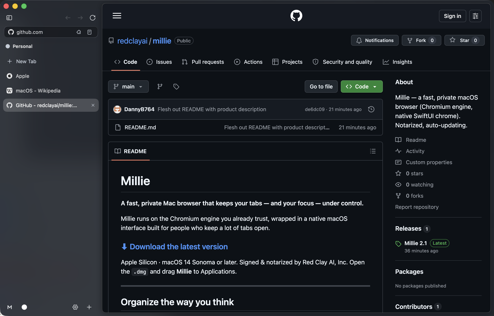

# Millie

**A fast, private Mac browser that keeps your tabs — and your focus — under control.**

Millie runs on the Chromium engine you already trust, wrapped in a native macOS interface built for people who keep a lot of tabs open.

### [⬇︎ Download the latest version](https://github.com/redclayai/millie/releases/latest)

Apple Silicon · macOS 14 Sonoma or later. Signed & notarized by Red Clay AI, Inc. Open the `.dmg` and drag **Millie** to Applications.

---

## Organize the way you think

- **Spaces** — keep Work, Personal, and side projects in separate sidebars, each with its own tabs, theme, and identity. Swipe between them with two fingers, or jump straight to one with ⌃1–9.
- **Profiles** — give each Space isolated storage: separate logins, cookies, history, and extensions. Sign into the same site twice without conflicts.
- **Smart folders** — group tabs into folders that show each site's icon at a glance.
- **Tidy Tabs** — one click closes duplicates and groups the rest by site.

## Keep the tools you live in one click away

- **Web Panels** — pin the apps you keep coming back to — chat, music, a calendar, your notes — into a slide-in side panel that lives beside whatever you're reading. Right-click any tab and choose **Add to Web Panels**.

## Built for power users

- Tear a tab out into its own window — just drag it past the edge.
- Split view for two pages side by side.
- A command bar (⌘T) to search, switch tabs, and run actions instantly.
- Most-recently-used ⌘-Tab switching with live tab previews.
- **Peek** any link in a floating overlay, then promote it into a full tab or a split when you want to keep it.
- Familiar Chrome keyboard shortcuts work out of the box — and a complete cheat sheet is one ⌘/ away.

## Private by default

- Built on **ungoogled-chromium** — Google's account hooks and background phone-home are stripped out.
- Built-in ad blocking.
- Per-profile isolation keeps your worlds apart.

## Everything you expect

- Chrome Web Store extensions (1Password, uBlock Origin, and more) — install them per profile or across all of them at once.
- Reader view, per-site **Boosts** (custom CSS/JS), link **Peek**, and **View Page Source** on any page.
- **Screenshots** — grab a region, or capture a whole scrolling page end to end — then **Share** straight to Mail, Messages, or AirDrop through the macOS share sheet.
- Tidy Picture-in-Picture, and **Keep Awake** to stop a tab from sleeping mid-task.
- Idle tabs sleep to save memory and archive themselves when stale.
- A built-in AI assistant that can read pages and help you get things done.

## Always current

Millie updates itself automatically — security fixes included — so you're always on the latest. You can also check manually in **Settings → About → Check for Updates…**.

---

Millie is built on the Chromium open-source project. © Red Clay AI, Inc.
